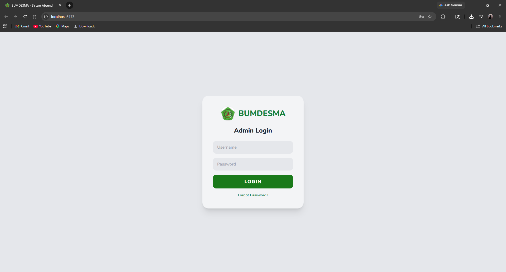
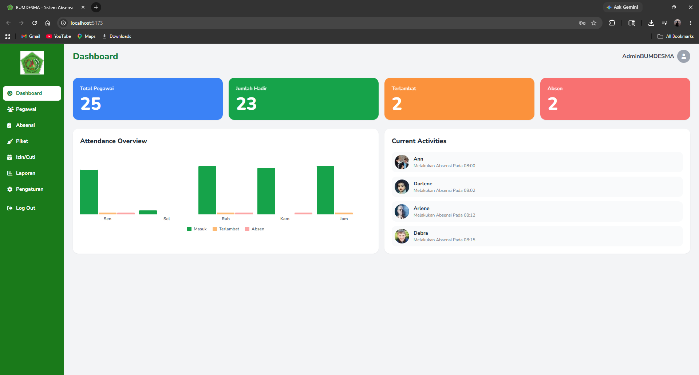
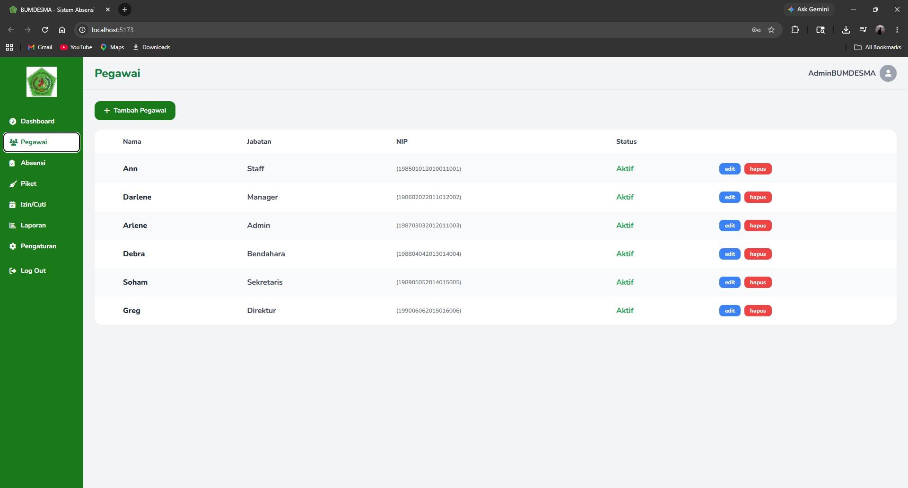
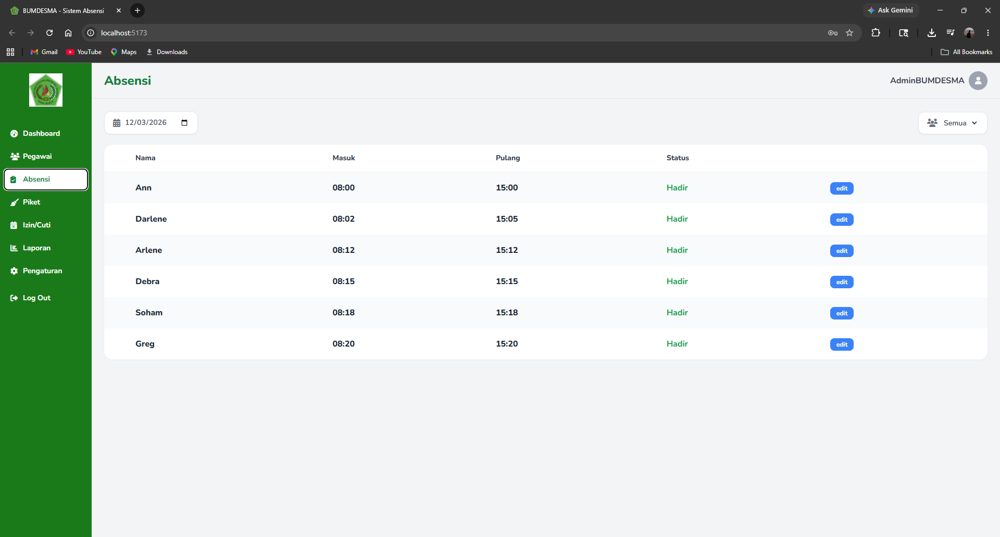
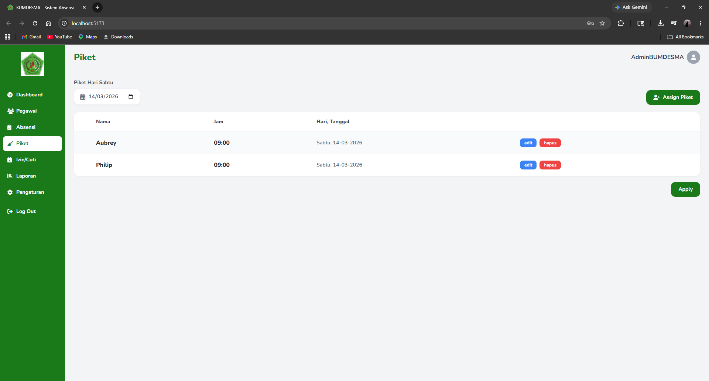
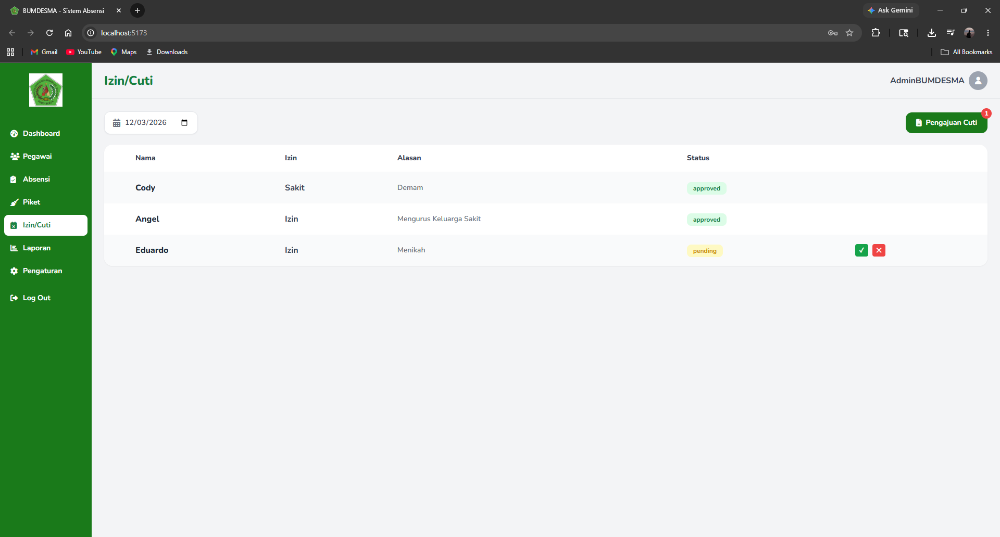
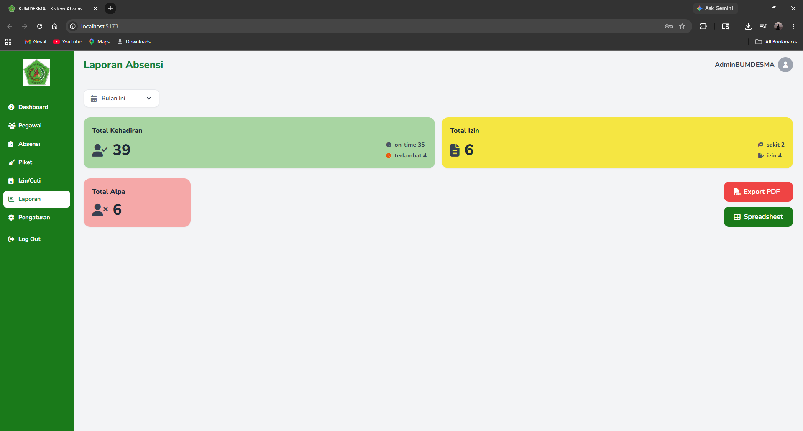
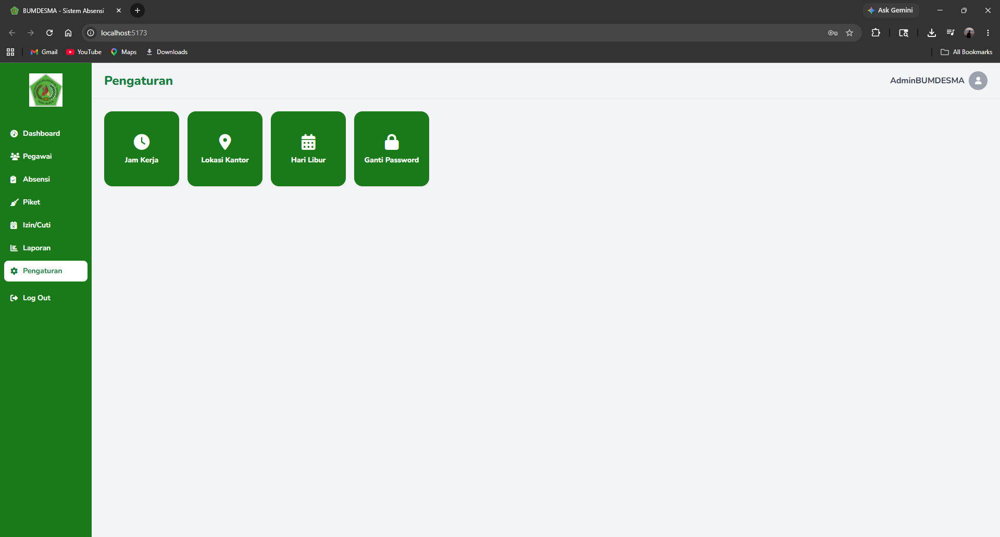

# 🏢 BUMDESMA — Sistem Absensi (Website Admin & Pimpinan)

Aplikasi web untuk Admin & Pimpinan BUMDESMA (Badan Usaha Milik Desa
Bersama) mengelola absensi karyawan. Dibangun dengan **React + Vite +
Tailwind CSS**, terhubung ke REST API `bumdesma-backend`.

---

## 🚀 Teknologi

- **React** + **Vite**
- **Tailwind CSS**
- **Font Awesome** (ikon)
- **Google Fonts** — Nunito
- **axios** — HTTP client ke backend

---

## ✨ Fitur

| Halaman       | Deskripsi                                                        |
| ------------- | ----------------------------------------------------------------- |
| 🔐 Login      | Autentikasi Admin/Pimpinan (**username** + password)              |
| 📊 Dashboard  | Statistik kehadiran & grafik mingguan                             |
| 👥 Pegawai    | Manajemen data karyawan (CRUD, tabel `users`)                     |
| 📋 Absensi    | Rekap & koreksi manual data absensi harian                        |
| 🧹 Piket      | Penjadwalan piket + tombol **Kirim Notifikasi** ke app mobile karyawan |
| 📅 Izin/Cuti  | Peninjauan (Admin) & keputusan akhir (Pimpinan) atas pengajuan    |
| 📈 Laporan    | Ringkasan kehadiran, izin, dan alpa; export PDF/Spreadsheet        |
| ⚙️ Pengaturan | Jam kerja, lokasi kantor, hari libur, ganti password              |

> Karyawan **tidak** login lewat website ini — mereka pakai app mobile
> (NIP + password). Website ini khusus untuk Admin & Pimpinan.

---

## 🛠️ Cara Menjalankan

### Prasyarat
- Node.js >= 18
- npm atau yarn
- `bumdesma-backend` sudah berjalan (default `http://localhost:5000`)

### Instalasi

```bash
npm install
cp .env.example .env
# sesuaikan VITE_API_BASE_URL jika backend tidak berjalan di localhost:5000
npm run dev
```

Buka browser dan akses: `http://localhost:5173`

### Build Production

```bash
npm run build
```

---

## 📂 Struktur Proyek

```
src/
├── components/
│   ├── Sidebar.jsx        # Navigasi sidebar
│   └── Topbar.jsx         # Header halaman
├── context/
│   └── AuthContext.jsx    # State login, persist token di localStorage
├── lib/
│   └── api.js             # axios client + interceptor JWT
├── pages/
│   ├── Login.jsx          # Login username + password (admin-login)
│   ├── Dashboard.jsx
│   ├── Pegawai.jsx        # CRUD karyawan (tabel users, tanpa role/departemen)
│   ├── Absensi.jsx
│   ├── Piket.jsx          # Assign piket + tombol Kirim Notifikasi
│   ├── Cuti.jsx
│   ├── Laporan.jsx
│   └── Pengaturan.jsx
├── App.jsx
├── main.jsx
└── index.css
```

---

## 🔐 Login

Login memakai **username + password** ke `POST /api/auth/admin-login`
(bukan NIP — NIP dipakai khusus login karyawan di app mobile). Akun
tersimpan di tabel `admin_accounts` pada backend, dibedakan lewat kolom
`role` (`admin` / `pimpinan`); sidebar & hak akses menyesuaikan role akun
yang login.

### Akun default (dari seeder backend)

| Role | Username | Password |
|---|---|---|
| Admin | `admin` | `Admin@12345` |
| Pimpinan | `pimpinan` | `Pimpinan@12345` |

---

## 🧹 Fitur Notifikasi Piket

Alur di halaman **Piket**:
1. Admin assign piket ke karyawan seperti biasa (tombol **Assign Piket**).
2. Baris jadwal piket baru muncul dengan status **belum terkirim** (tombol
   biru **"Kirim Notifikasi"**).
3. Admin klik tombol itu → backend membuat notifikasi in-app untuk karyawan
   bersangkutan → status berubah jadi badge hijau **"Terkirim"**.
4. Karyawan melihat badge merah di lonceng Dashboard app mobile begitu
   notifikasi terkirim.

---

## 📸 Screenshots

### 🔐 Login


### 📊 Dashboard


### 👥 Pegawai


### 📋 Absensi


### 🧹 Piket


### 📅 Izin/Cuti


### 📈 Laporan


### ⚙️ Pengaturan


---

## 🖼️ Logo

Letakkan file logo di `public/logo.png` agar tampil di sidebar dan halaman login.

---

## Catatan CORS

Backend sudah mengaktifkan `cors()` secara default (mengizinkan semua origin)
sehingga tidak perlu konfigurasi tambahan untuk development. Untuk
production, batasi origin di `src/app.js` backend sesuai domain frontend
yang di-deploy.

---

## 👤 Data Diri

|                   |                           |
| ----------------- | ------------------------- |
| **Nama**          | Fernandhito Dian Pratama  |
| **NRP**           | 3124510004                |
| **Program Studi** | D3 PJJ Teknik Informatika |

---

## 📝 Lisensi

Proyek ini dibuat untuk keperluan akademik (Proyek Akhir).
